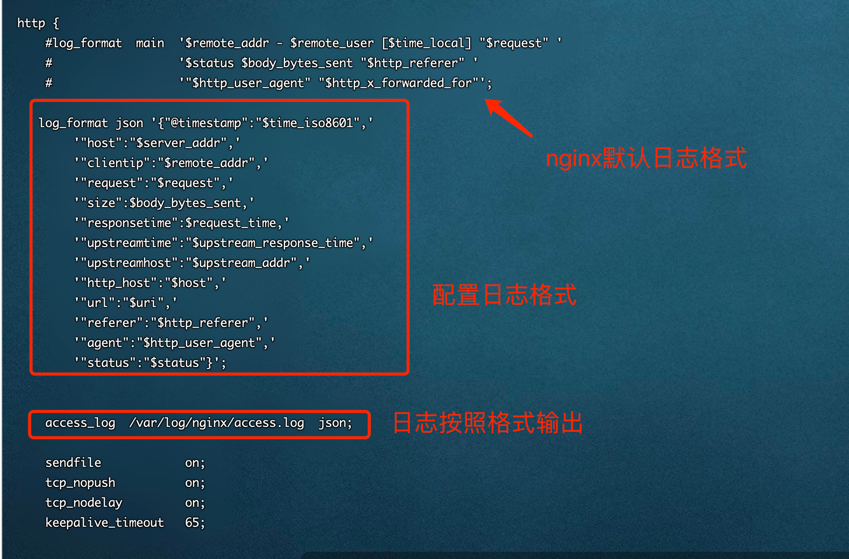

# Nginx 日志输出到Logstash 

 - 1. nginx.conf相关配置：
        ````   
           
           log_format json '{"@timestamp":"$time_iso8601",'
           '"host":"$server_addr",'
           '"clientip":"$remote_addr",'
           '"request":"$request",'
           '"size":$body_bytes_sent,'
           '"responsetime":$request_time,'
           '"upstreamtime":"$upstream_response_time",'
           '"upstreamhost":"$upstream_addr",'
           '"http_host":"$host",'
           '"url":"$uri",'
           '"referer":"$http_referer",'
           '"agent":"$http_user_agent",'
           '"status":"$status"}';
        
            access_log  /var/log/nginx/access.log  json;


- 2. 把nginx日志文件挂在到容器内，参考docker-logstash.yml的目录挂载
      

- 2. logstash.conf配置，参考 pipeline/logstash.conf配置：
     
    
