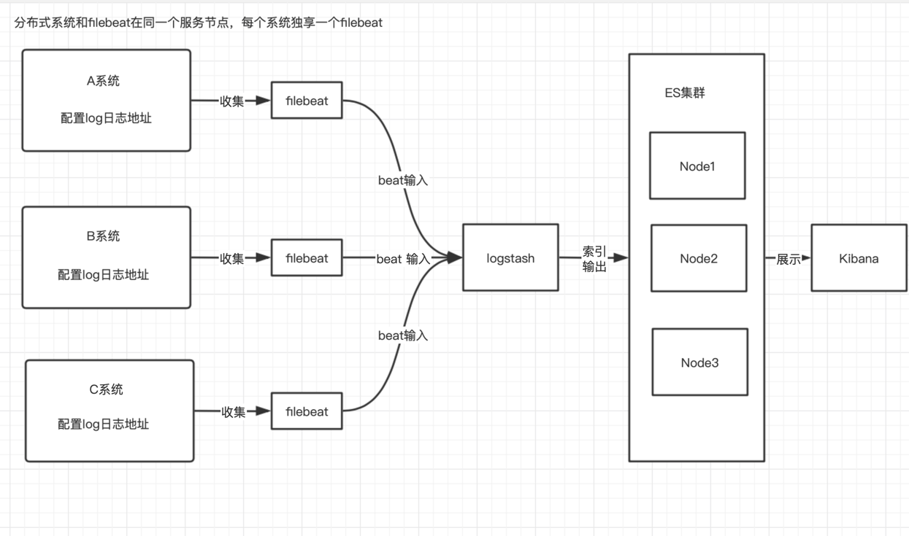

# 分布式系统ELK的使用（filebeat收集推并送日志给logstash）

- 总结： 
    ````
      之前是应用直接在logback-dev.yml的配置中指定logstash地址，直接走tcp推送日志到logstash，然后适当筛选转送到es中生成索引和文档。
      但是随着系统的分化为分布式系统后，各个应用均要使用到内存等资源，并且logstash是java应用（JVM）非常消耗内存和CPU资源，filebeat是golang开发的，轻便并且消耗较小资源
      所以logstash安装在应用部署的机器上显得非常的笨重。最常见的做法是用filebeat部署在应用的机器上，logstash单独部署，然后由
      filebeat将应用日志收集给logstash解析，解析完由logstash再传给elasticsearch。   
   
    
- 流程：
  
  


- 配置：
    ````
  
      1. 配置docker文件： ./filebeat/docker-filebeat.yml
          注意挂载日志文件到容器内！
  
      2. 配置filebeat配置文件： ./filebeat/conf/filebeat.yml
          这里有logstash推送地址，以及需要推送的日志文件 （也可以直接推送到ES）
  
      3. 配置logstash接收 ： ./logstash/pipeline/logstash.conf
